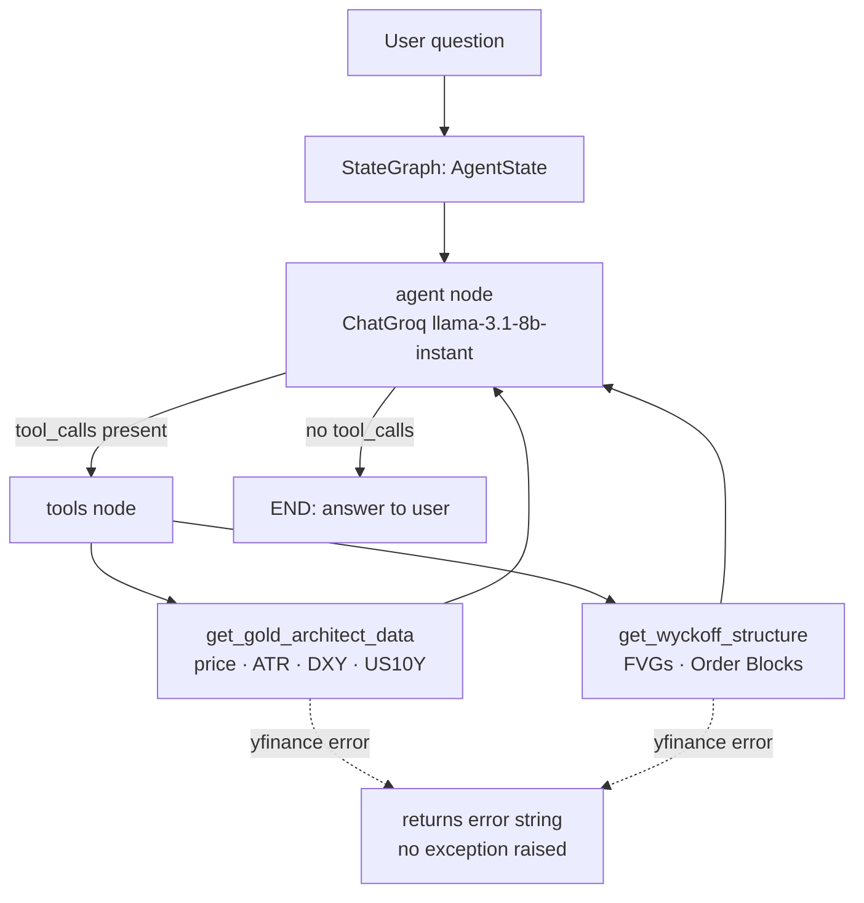
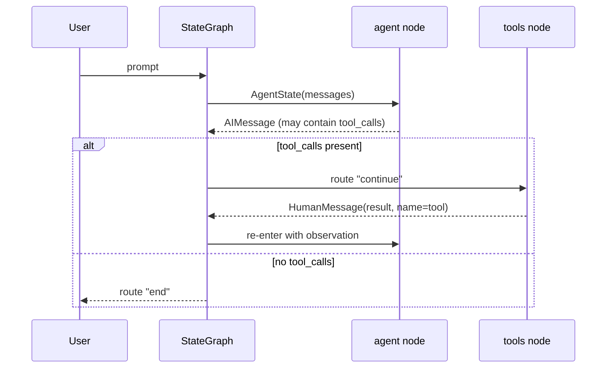

# Nexus Quant — Architecture

Nexus Quant is an agentic market-structure analyser. It answers one question repeatedly:
*what does the current structure of the gold market look like, expressed as numbers rather than opinions?*

## Design boundary

Two kinds of work happen in this system, and they are deliberately kept apart:

| Work | Where it lives | Why |
|---|---|---|
| **Measurement** — prices, ATR volatility, Fair Value Gaps, Order Blocks | deterministic Python (`tools.py`) | the same input must always produce the same numbers |
| **Selection and narration** — which measurement to run, how to describe the result | LLM agent (`agents.py`) | the model routes and explains; it does not invent the numbers |

The model is never asked to compute an indicator. It can only choose a tool and read its output.

## Component view

`tools.py` exposes two LangChain tools. Both are wrapped in `try/except` and return a human-readable
error string instead of raising, so a data-provider outage degrades the answer rather than killing the graph.

## State and control flow

The state is `AgentState = {messages: Annotated[List[BaseMessage], operator.add]}` — an append-only
transcript. Nothing is mutated in place, so the reasoning path that produced an answer can be read back
from the message list.

## Data flow

1. `get_gold_architect_data` — 5-day and 20-day `GC=F` history, ATR(14) on the longer window, plus `DX-Y.NYB` and `^TNX` for the dollar and rate context.
2. `get_wyckoff_structure` — 60-day 4-hour `GC=F` history; scans for bullish/bearish Fair Value Gaps and for displacement bars that identify Order Blocks.
3. Both return compact, delimited strings (`PRC: … | OB_S: … | OB_D: …`) that fit comfortably in a small model's context window.

## Failure modes

| Failure | Current behaviour | Impact |
|---|---|---|
| Market-data provider unavailable | tool returns `Macro Error: Data acquisition failed.` / `Structure Error: Engine recalibrating.` | the agent answers without that measurement; no crash |
| Too little history (< 15 bars) | `Insufficient data for structural mapping.` | structural claims are withheld instead of guessed |
| Missing `GROQ_API_KEY` | `ChatGroq` rejects the request at call time | the UI shows the error; no partial state |
| No FVG / no displacement detected | renders `N/A` / `0.0` | absence is reported explicitly, not silently |

## Testing

`tests/` runs without network access and without a model call:

- `test_tools.py` replaces `yfinance.Ticker` with deterministic frames and asserts the ATR formatting, the FVG range, the Order Block level, the short-series guard and both error strings.
- `test_engine.py` builds the graph and asserts the node/edge topology and the `_should_continue` routing decisions.

## Known limitations

- Order Block and FVG detection are rule-based heuristics over OHLC data, not validated prediction models.
- `yfinance` is a convenience data source; spread and timestamp differences against a broker terminal are expected.
- The interface is Streamlit: suitable for research and demonstration, not for unattended operation.
- No performance claim is made anywhere in this repository. This is a measurement tool, not a trading system.
